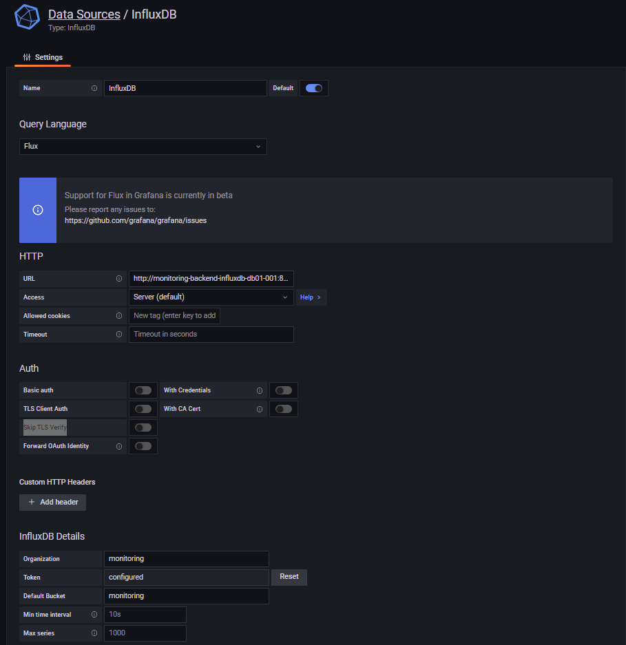

# grafana + telegraf + promtail + loki


# setup

<br>

## はじめに
README.md ファイルがある場所へ移動  
シークレットを含んだファイル(★add, ★fix)の追加、修正を行い deploy する流れ  
cat リダイレクトでファイル作成例としているが、エディタでの作成を推奨  
```
.
├── README.md
├── grafana
│   ├── deployment-backend-grafana-db01.yaml
│   ├── deployment-frontend-grafana-app01.yaml
│   └── grafana.ini ★add
├── influxdb
│   ├── configmap-influxdb-init01.yaml
│   └── deployment-backend-influxdb-db01.yaml
├── kustomization.yaml ★fix
├── label-transformer.yaml
├── loki
│   ├── config.yaml
│   └── deployment-frontend-loki-app01.yaml
├── namespace.yaml
├── password.txt ★add
├── promtail
│   ├── config.yaml
│   └── daemonset-backend-agent01.yaml
├── rbac
│   ├── rbac-influxdb.yaml
│   ├── rbac-prometheus.yaml
│   ├── rbac-promtail.yaml
│   └── rbac-telegraf.yaml
├── telegraf
│   ├── daemonset-backend-agent01.yaml
│   └── telegraf.conf ★add
└── token.txt ★add
```

<br>

## kustomize.yaml setup
secretGenerator で作成するパスワード、トークンファイル作成
```bash
echo -n 'password' > password.txt
```
```bash
echo -n 'token' > token.txt
```

<br>

## grafana setup
kustomization.yaml で指定したパスワードに修正し、grafana/grafana.ini ファイル作成

[database]  
  password = 修正  
  mysql://grafana:修正~  

[session]  
  provider_config = `grafana:修正@tcp~  


```bash
cat <<'EOF'> grafana/grafana.ini
[server]
  protocol = http
  http_port = 3000
[database]
  type = mysql
  host = monitoring-backend-grafana-db01-001:3306
  name = grafana
  user = grafana
  password = 修正
  ssl_mode = disable
  mysql://grafana:修正@monitoring-backend-grafana-db01-001:3306/grafana
[session]
  provider_config = `grafana:修正@tcp(monitoring-backend-grafana-db01-001:3306)/grafana` 
  provider = mysql
[analytics]
  reporting_enabled = false
  check_for_updates = true
[log]
  mode = console
  level = info
[paths]
  data         = /var/lib/grafana/data
  logs         = /var/log/grafana
  plugins      = /var/lib/grafana/plugins
  provisioning = /etc/grafana/provisioning
[unified_alerting]
  enabled = true
[datasources]
[remote_cache]
[dataproxy]
[security]
[snapshots]
[dashboards]
[users]
[auth]
[auth.anonymous]
[auth.github]
[auth.gitlab]
[auth.google]
[auth.grafana_com]
[auth.azuread]
[auth.okta]
[auth.generic_oauth]
[auth.basic]
[auth.proxy]
[auth.jwt]
[auth.ldap]
[aws]
[azure]
[smtp]
[emails]
[log]
[log.console]
[log.file]
[log.syslog]
[log.frontend]
[quota]
[unified_alerting]
[alerting]
[annotations]
[annotations.dashboard]
[annotations.api]
[explore]
[metrics]
[metrics.environment_info]
[metrics.graphite]
[grafana_com]
[tracing.jaeger]
[external_image_storage]
[external_image_storage.s3]
[external_image_storage.webdav]
[external_image_storage.gcs]
[external_image_storage.azure_blob]
[external_image_storage.local]
[rendering]
[panels]
[plugins]
[live]
[plugin.grafana-image-renderer]
[log]
[enterprise]
[feature_toggles]
[date_formats]
[expressions]
[geomap]
EOF
```

<br>

## telegraf setup
kustomization.yaml で指定したトークンに修正、disk 等の監視対象の調整を行い telegraf/telegraf.conf ファイル作成  
[[outputs.influxdb_v2]]  
  token = "修正"  
[[inputs.disk]]  
  fstype = [ "ext4", "xfs" ]  
  path = [ "/", "/backup", "/var/lib/longhorn" ]  

```bash
cat <<'EOF'> telegraf/telegraf.conf
[agent]
  interval = "60s"
  round_interval = true
  metric_batch_size = 1000
  metric_buffer_limit = 10000
  collection_jitter = "0s"
  flush_interval = "10s"
  flush_jitter = "0s"
  precision = ""
  hostname = "$HOSTNAME"
  omit_hostname = false
[[outputs.influxdb_v2]]
  urls = ["http://monitoring-backend-influxdb-db01-001:8086"]
  token = "修正"
  organization = "monitoirng"
  bucket = "monitoring"
  timeout = "5s"    
[[inputs.cpu]]
  percpu = true
  totalcpu = true
  fielddrop = ["time_*"]
[[inputs.system]]
[[inputs.disk]]
  ignore_fs = ["tmpfs", "devtmpfs", "devfs", "iso9660", "overlay", "aufs", "squashfs"]
  mount_points = ["/", "/backup", "/var/lib/longhorn"]
[inputs.disk.tagpass]
  fstype = [ "ext4", "xfs" ]
  path = [ "/", "/backup", "/var/lib/longhorn" ]
[[inputs.diskio]]
  devices = ["sd*"]
[[inputs.kernel]]
[[inputs.mem]]
[[inputs.processes]]
[[inputs.swap]]
[[inputs.system]]
[[inputs.net]]
[[inputs.netstat]]
[[inputs.interrupts]]
[[inputs.linux_sysctl_fs]]
[[inputs.docker]]
  endpoint = "unix:///var/run/docker.sock"
[[inputs.kubernetes]]
  url = "https://$HOSTIP:10250"
  bearer_token = "/run/secrets/kubernetes.io/serviceaccount/token"
  insecure_skip_verify = true
EOF
```

<br>

## kustomization.yaml の patchesStrategicMerge を修正して storageclass,resources の調整
```
patchesStrategicMerge:
- |-
  apiVersion: v1
  kind: PersistentVolumeClaim
  metadata:
    name: frontend-grafana-app01
  spec:
    accessModes:
      - ReadWriteMany
    resources:
      requests:
        storage: 調整
    storageClassName: 調整
```

<br>
<br>

# deploy 
## deploy namespace
```
kubectl apply -f namespace.yaml
```

## deploy resource
```
kubectl apply -k ./
```

<br>
<br>

# Grafana datasource setting
## Influxdb setting
- Query Language
  - Flux
- url
  - http://monitoring-backend-influxdb-db01-001:8086
- Access
  - Server(default)
- InfluxDB Details
  - Organization
    - monitoring
  - Token
    - token
  - Default Bucket
    - monitoring



<br>

## Loki setting
- HTTP
  - URL
    - http://monitoring-frontend-loki-app01-001.monitoring.svc.cluster.local:3100

